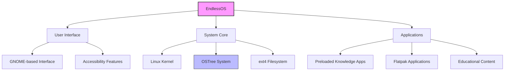
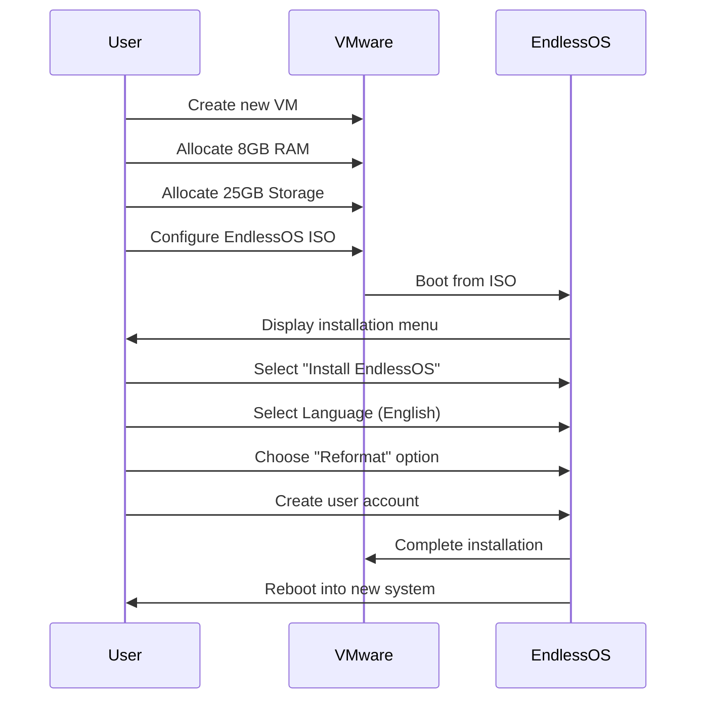
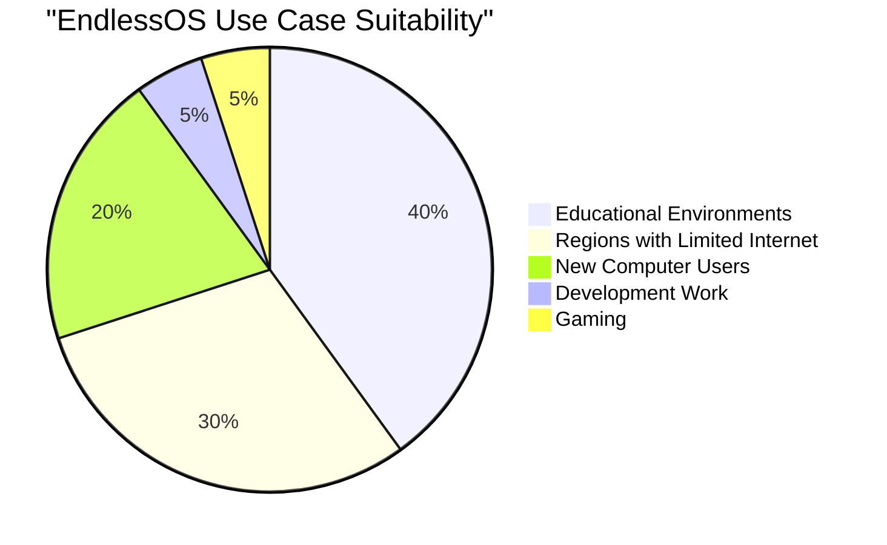
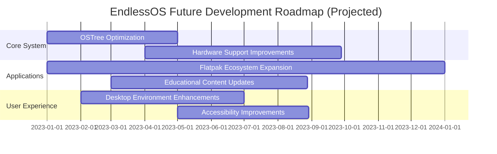
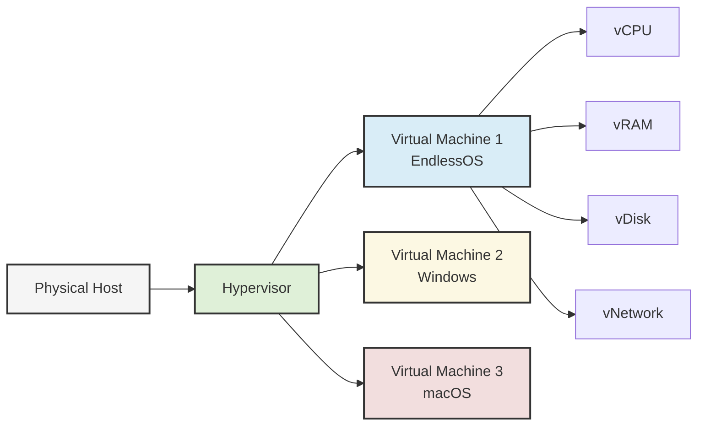
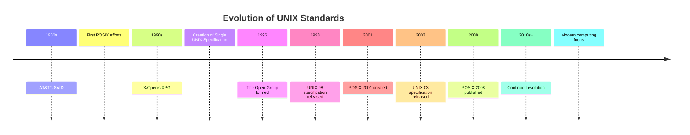
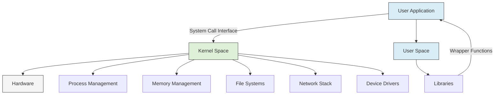
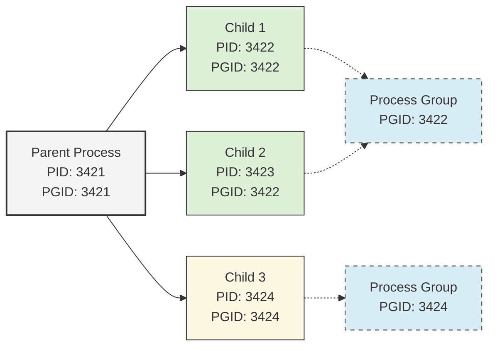

<div align= "center">

<h1>EndlessOS</h1>
</div>
This repository contains comprehensive documentation for EndlessOS, a Linux-based operating system designed with simplicity and accessibility in mind. The project explores the installation, features, and technical aspects of EndlessOS.

## Table of Contents

<details open>
<summary><strong>Main Documentation</strong></summary>

- [Introduction](#introduction)
- [Objectives](#objectives)
- [Requirements](#requirements)
- [Installation Steps](#installation-steps)
- [Issues and Solutions](#issues-and-solutions)
- [Filesystem Support](#filesystem-support)
- [Advantages and Disadvantages](#advantages-and-disadvantages)
- [Conclusion](#conclusion)
- [Future Outlook](#future-outlook)
- [Virtualization](#virtualization)
- [UNIX Standardization](#unix-standardization)

</details>

<details>
<summary><strong>System Calls Implementation</strong></summary>

- [Understanding System Calls](#understanding-system-calls)
- [The setpgid() System Call](#the-setpgid-system-call)
- [Implementation Process](#implementation-process)
- [Program Output](#program-output)
- [Observations and Learning](#observations-and-learning)

</details>

## Introduction

### Background
EndlessOS is a Linux-based operating system designed with simplicity and accessibility in mind. It was developed by Endless Computer (now part of Endless OS Foundation) with the goal of making computing accessible to everyone, regardless of their technical expertise or internet connectivity.

The operating system was first released in 2014 and has since evolved into a robust platform that focuses on offline usability, educational content, and a user-friendly interface. EndlessOS is particularly targeted toward regions with limited or no internet access, making it an ideal choice for educational institutions and communities in developing areas.

### Motivation
The motivation for exploring EndlessOS stems from its unique approach to operating system design and its focus on accessibility. As computing becomes increasingly essential in all aspects of life, operating systems that bridge the digital divide become crucial. EndlessOS addresses this need directly with its innovative offline content model and user-centric design.

Additionally, EndlessOS's implementation of the OSTree system for managing updates and application distribution presents an interesting case study in modern OS design. By examining and documenting this system, we aim to improve understanding of alternative approaches to package management and system updates beyond traditional methods found in other Linux distributions.

## System Architecture



## Objectives

- To successfully install EndlessOS in a virtual environment
- To document the installation process thoroughly with detailed steps and screenshots
- To explore and understand the unique features of EndlessOS, particularly its offline content model
- To analyze the filesystem structure and support in EndlessOS
- To identify potential challenges in using EndlessOS and document solutions
- To implement and understand system calls (specifically setpgid()) in the EndlessOS environment
- To examine the advantages and disadvantages of EndlessOS compared to other operating systems
- To understand virtualization concepts in the context of modern operating systems
- To gain insights into UNIX standardization and its impact on operating systems like EndlessOS

## Requirements

### Hardware Requirements

- Processor: 2 GHz dual core processor or better
- RAM: Minimum 2GB (4GB recommended for smooth operation)
- Storage: At least 20GB of free disk space
- Graphics: Any GPU capable of supporting OpenGL 3.0
- Host System: Windows 10/11, macOS, or Linux with adequate resources to run virtualization software

### Software Requirements

- Virtualization software: VMware Workstation 17 or Oracle VM VirtualBox (version 6.1 or later)
- EndlessOS ISO file (latest stable version: 4.0.0)
- Internet connection for downloading the ISO and potential updates
- Image and text editing software to help with documentation (optional)

## Installation Steps

### Setting up the Virtual Machine

The installation process began by setting up a new virtual machine in VMware Workstation 17 with appropriate specifications for EndlessOS.



### Installation Process Steps

1. Created a new VM in VMware Workstation 17 and allocated 8GB RAM and 25GB storage
2. Configured the VM to use the EndlessOS ISO as the boot medium
3. Started the VM and selected the "Install EndlessOS" option from the boot menu
4. Selected English as the language and continued with the installation
5. Chose the "Reformat" option for disk partitioning to use the entire virtual disk
6. Created user account using full name
7. Completed the installation and rebooted into the newly installed system

### Installation Screenshots

#### VM Setup Process

*Creating the new virtual machine*


*Selecting the VM type*


*Configuring the VM settings*


*Allocating resources to the VM*


*Configuring storage options*


*Finalizing VM configuration*

#### EndlessOS Installation Process

*EndlessOS boot screen*


*Language selection*


*Keyboard layout selection*


*Setting the timezone*


*Disk partitioning options*


*Confirming disk formatting*


*Creating user account*


*Installation progress*


*Installation complete*

#### First Boot and Configuration

*First boot welcome screen*


*Desktop environment*


*System settings panel*


*Application launcher showing preinstalled apps*


*File manager and system navigation*


*System information and hardware details*


*Software update center*


*Terminal access and command line interface*

#### Issues and Troubleshooting

*Display resolution error before installing guest additions*


*Network connectivity issue with NAT configuration*

## Issues and Solutions

### Problems Faced During Installation

- **Virtual Machine Display Resolution:** After initial installation, the VM was stuck at a low resolution (1024x768) and wouldn't automatically adjust to the VM window size.
- **VMware Workstation Guest Additions:** Attempted installation of VMware Workstation Guest Additions failed initially due to missing development packages.
- **Network Connectivity:** The network connection initially showed as connected but couldn't access the internet, preventing system updates.
- **OSTree Update Errors:** Received errors when trying to update the system using the OSTree mechanism unique to EndlessOS.

### Resolving Installation Issues

- **Display Resolution Issue:** Resolved by manually installing the VMware Workstation Guest Additions after installing the necessary development packages:
  ```bash
  $ sudo apt update
  $ sudo apt install build-essential linux-headers-$(uname -r)
  $ sudo sh /media/cdrom/VBoxLinuxAdditions.run
  ```
  After a reboot, the display resolution adjusted properly.

- **Network Connectivity Issue:** Fixed by changing the network adapter settings in VMware Workstation from NAT to Bridged Adapter, which allowed the VM to connect directly to the network.

- **OSTree Update Errors:** Fixed by synchronizing the system time:
  ```bash
  $ sudo timedatectl set-ntp true
  ```
  After that, the system updates proceeded normally.

## Filesystem Support

### EndlessOS Filesystem

EndlessOS primarily uses the **ext4** filesystem for its main partition. This choice is made for several important reasons:

- **Reliability:** ext4 is a mature and extensively tested filesystem in the Linux ecosystem, providing robust data integrity protection.
- **Performance:** It offers good performance characteristics for both small and large files.
- **Journal Support:** The journaling feature in ext4 helps prevent filesystem corruption during power failures or system crashes.
- **Extended Attributes:** ext4 supports extended attributes which are useful for the OSTree deployment system used by EndlessOS.
- **Large File Support:** It can handle files up to 16TB and volumes up to 1EB, which is more than adequate for typical use cases.

```mermaid
graph TD
    subgraph "EndlessOS Filesystem Structure"
        A[Root Filesystem] --> B[/]
        B --> C[/home - ext4]
        B --> D[/var - ext4]
        B --> E[/boot - ext4]
        B --> F[OSTree deployment - ext4]
        E --> G[GRUB configuration]
        F --> H[Read-only system image]
        F --> I[Applications]
    end
```

### Other Supported Filesystems

EndlessOS, being based on Linux, also supports mounting and reading from various other filesystems:

- **FAT32:** Supported for compatibility with removable media and dual-boot systems with Windows.
- **NTFS:** Supported through ntfs-3g for accessing Windows partitions.
- **exFAT:** Supported for removable media that exceeds FAT32's 4GB file size limitation.
- **Btrfs:** Basic support is available, though not recommended for the system partition.
- **HFS+ and APFS:** Limited read-only support for macOS partitions.

The OSTree system used by EndlessOS for managing the system image also has specific filesystem requirements, which ext4 satisfies well. This deployment model, similar to what's used in platforms like Android, helps ensure system integrity and makes updates more reliable.

## Advantages and Disadvantages

### Advantages of EndlessOS

- **Offline Content:** The bundled knowledge apps provide valuable information without requiring internet access.
- **User-Friendly Interface:** The GNOME-based interface is intuitive and approachable for new users.
- **OSTree Updates:** The atomic update system ensures system stability and prevents broken packages.
- **Low Resource Requirements:** Can run effectively on older hardware compared to some other modern operating systems.
- **Educational Focus:** Built-in educational content makes it excellent for learning environments.
- **Flatpak Support:** The use of containerized applications enhances security and simplifies application management.
- **Stability:** The read-only system partition prevents common system corruption issues.

### Disadvantages of EndlessOS

- **Limited Application Ecosystem:** Fewer available applications compared to mainstream distributions.
- **Customization Restrictions:** The read-only nature of the system partition limits advanced customization.
- **Development Environment:** Not ideal for developers due to the restricted nature of the system.
- **Update Size:** OSTree updates can be larger than traditional package-based updates.
- **Hardware Compatibility:** May have issues with very recent or uncommon hardware due to its stable but not cutting-edge kernel.
- **Limited Package Management:** Traditional apt/dpkg commands don't work as expected since the system uses OSTree and Flatpak.



## Conclusion

Throughout this project, valuable insights have been gained into EndlessOS and its unique approach to operating system design. EndlessOS successfully achieves its primary goals of providing an accessible, user-friendly computing experience with a focus on offline usability and educational content.

The installation process in a virtual environment was generally straightforward, with only minor issues that were resolved through standard troubleshooting steps. The system's performance within VMware Workstation was satisfactory, providing a smooth user experience once the Guest Additions were properly configured.

The OSTree deployment model used by EndlessOS represents an innovative approach to system updates and maintenance. This model enhances system reliability by treating the operating system as an atomic unit, reducing the likelihood of update-related issues that plague many traditional Linux distributions.

EndlessOS's filesystem choice of ext4 balances performance, reliability, and compatibility needs effectively. The system's approach to applications, leveraging Flatpak for containerized applications, enhances security while maintaining ease of use.

For users in regions with limited internet connectivity or for educational environments, EndlessOS offers significant advantages over other options. Its preloaded content and emphasis on offline functionality make it uniquely suited for bridging digital divides.

The implementation of system calls, particularly setpgid(), demonstrated that despite its user-friendly focus, EndlessOS retains the powerful underpinnings of a Linux system, allowing for advanced operations and programming.

EndlessOS represents a compelling option for specific use cases, particularly in educational environments and areas with limited connectivity. Its innovative approach to system design offers valuable lessons for the broader operating system landscape.

## Future Outlook

### Future Direction

EndlessOS is positioned to continue evolving in several important directions:

- **Integration with Cloud Services:** As internet access expands globally, EndlessOS could benefit from better integration with cloud services while maintaining its offline-first approach.
- **Application Ecosystem Growth:** The Flatpak ecosystem continues to grow, which will naturally expand the software available to EndlessOS users.
- **Educational Content Expansion:** There's significant potential for expanding the educational content available in EndlessOS, particularly in STEM fields.
- **Hardware Support Improvements:** Continued updates to the Linux kernel will improve hardware compatibility over time.
- **OSTree Advancements:** The OSTree system is still evolving, and future improvements could enhance update efficiency and reduce bandwidth requirements.

### Recommendations

Based on experience with EndlessOS, the following improvements and changes are recommended:

- **Better Virtualization Support:** Streamlining the process of installing Guest Additions would improve the virtualization experience.
- **Expanded Developer Tools:** Adding more developer-focused tools and documentation would make the system more appealing to technical users.
- **Offline Documentation:** Including more comprehensive offline documentation would align with the system's offline-first philosophy.
- **Incremental Updates:** Implementing more efficient delta updates would reduce bandwidth requirements for users with limited connectivity.
- **Customization Options:** Providing more user-facing customization options without compromising the system's integrity would benefit power users.
- **Enterprise Features:** Adding features for centralized management would make EndlessOS more viable for educational institutions and businesses.



## Virtualization

### What is Virtualization?

Virtualization is a technology that creates an abstraction layer over computer hardware, allowing multiple operating systems and applications to share a single physical machine's resources. It enables the creation of virtual machines (VMs) that behave like independent computers with their own virtual hardware, including CPU, memory, storage, and networking interfaces, all running on a physical host system.

### Why Virtualization Matters

Virtualization has become a cornerstone of modern computing for several important reasons:

- **Resource Efficiency:** Virtualization allows for better utilization of hardware resources by running multiple virtual systems on a single physical machine.
- **Isolation and Security:** Virtual machines provide strong isolation between environments, enhancing security and stability.
- **Flexibility and Portability:** VMs can be easily moved between host systems, enabling better disaster recovery and load balancing.
- **Testing and Development:** Virtualization creates safe environments for testing software without affecting production systems.
- **Legacy Application Support:** Older applications that require specific OS versions can be run in VMs on modern hardware.
- **Cost Reduction:** By consolidating multiple systems onto fewer physical machines, organizations can significantly reduce hardware, energy, and maintenance costs.



### How Virtualization Works

Virtualization is implemented through software called a hypervisor or Virtual Machine Monitor (VMM), which manages the hardware resources and presents them to guest operating systems. There are two main types of hypervisors:

- **Type 1 (Bare-metal):** Runs directly on the host's hardware to control the hardware and manage guest operating systems. Examples include VMware ESXi, Microsoft Hyper-V, and Xen.
- **Type 2 (Hosted):** Runs on a conventional operating system like any other application. Examples include VMware Workstation (which was used for this project), Oracle VirtualBox, and Parallels Desktop.

The hypervisor creates and manages virtual machines by:
1. Emulating hardware devices for each VM
2. Scheduling VM access to physical CPU cores
3. Managing memory allocation and translation between virtual and physical memory addresses
4. Handling I/O operations between VMs and physical devices
5. Providing isolation between different VMs

Modern CPUs include hardware extensions (Intel VT-x, AMD-V) that accelerate virtualization by reducing the overhead of running virtual machines, allowing near-native performance in many cases.

### Virtualization in EndlessOS Context

For this project, VMware Workstation was used to create a virtual machine running EndlessOS. This approach offered several advantages:

- The ability to test EndlessOS without modifying the host system's partitions
- Easy setup and teardown of test environments
- The ability to take snapshots at different stages of configuration
- Resource control to test performance under different conditions
- A safe environment for testing system calls and other low-level operations

Virtualization has fundamentally transformed modern computing, enabling cloud computing, containerization, and the flexible deployment models that define today's IT infrastructure. It continues to evolve with technologies like nested virtualization, GPU passthrough, and specialized security enhancements.

## UNIX Standardization

### The Significance of UNIX Standardization

UNIX standardization is crucial for ensuring compatibility and portability across different UNIX and UNIX-like operating systems. Standardization efforts have led to a common base of functionality that applications can rely on, regardless of the specific UNIX implementation they're running on. This has been vital for the growth of the UNIX ecosystem and the development of portable applications.



### Key Organizations in UNIX Standardization

Several organizations have played pivotal roles in standardizing UNIX:

- **The Open Group:** A vendor-neutral industry consortium that maintains the Single UNIX Specification (SUS) and owns the UNIX trademark.
- **IEEE (Institute of Electrical and Electronics Engineers):** Developed the POSIX standards through its standards committee.
- **ISO/IEC (International Organization for Standardization/International Electrotechnical Commission):** Adopted the POSIX standards as international standards.
- **X/Open:** Originally a separate organization that developed the X/Open Portability Guide (XPG), later merged into The Open Group.
- **AT&T:** The original creator of UNIX, whose System V Interface Definition (SVID) influenced many standardization efforts.

### The POSIX Standard

POSIX (Portable Operating System Interface) is a family of standards specified by the IEEE to define the API, shell, and utility interfaces for software compatible with variants of UNIX. It's important because it:

- Provides a baseline of functionality that all UNIX-like systems should implement
- Enables developers to write portable applications that work across different UNIX systems
- Forms the foundation for the Single UNIX Specification
- Is recognized internationally through ISO/IEC standardization

POSIX is divided into several parts:

- **POSIX.1 (IEEE Std 1003.1):** Core services including file I/O, process control, and basic system utilities
- **POSIX.2 (IEEE Std 1003.2):** Shell and utilities
- **POSIX.1b:** Real-time extensions
- **POSIX.1c:** Threads extensions

### The Single UNIX Specification (SUS)

The Single UNIX Specification is a standardization effort led by The Open Group that integrates and extends the POSIX standards. Its main goals are:

- Providing a single, comprehensive, and consistent set of standards for UNIX systems
- Ensuring backward compatibility while adding new functionality
- Defining conformance requirements for systems claiming UNIX certification
- Promoting application portability across different UNIX platforms

The SUS has evolved through several versions, including UNIX 95, UNIX 98, and UNIX 03, each adding new features and refining existing requirements.

### POSIX Compliance in EndlessOS

EndlessOS, being built on a Linux foundation, inherits significant POSIX compliance from the Linux kernel and GNU utilities. This compliance can be observed in several ways:

- The implementation of system calls like `setpgid()` follows POSIX semantics
- The shell environment provides POSIX-compliant command behavior
- File system operations adhere to POSIX requirements
- Process management follows POSIX specifications

While EndlessOS isn't formally certified under the Single UNIX Specification (as is common for many Linux distributions), its practical compliance with POSIX standards ensures good compatibility with UNIX applications and development practices.

### Challenges in UNIX Standardization

UNIX vendors face several challenges in adhering to standardization:

- **Balancing innovation with compatibility:** Adding new features while maintaining backward compatibility
- **Implementation differences:** Subtle variations in behavior even among compliant systems
- **Certification costs:** The expense of formal UNIX certification can be prohibitive for open-source projects
- **Evolving computing landscape:** Adapting standards to cloud, containers, and modern development practices

Despite these challenges, UNIX standardization continues to be vital for ensuring application portability and system interoperability in today's diverse computing environment.

## System Calls Implementation

### Understanding System Calls

System calls are the fundamental interface between applications and the operating system kernel. They allow user programs to request services from the operating system, such as file operations, process management, and network communications. In Unix-like systems like EndlessOS, system calls are the primary mechanism for applications to interact with hardware resources and maintain system security through controlled access.



### The setpgid() System Call

For this project, the focus was specifically on implementing and understanding the `setpgid()` system call. This system call is used to set the process group ID for a specified process. Process groups are collections of related processes that can receive signals together and are commonly used for job control in shell environments.

The function signature for `setpgid()` is:
```c
int setpgid(pid_t pid, pid_t pgid);
```

Where:
- `pid` is the process ID of the process whose group ID should be changed. If this is 0, the current process's ID is used.
- `pgid` is the new process group ID. If this is 0, the process ID specified by `pid` is used as the process group ID.

### Implementation Process

To demonstrate the use of the `setpgid()` system call in EndlessOS, a C program was created that creates multiple child processes and organizes them into process groups. This implementation helps illustrate how process groups work in a Unix-like environment.

First, the necessary development tools in EndlessOS were installed:
```bash
$ sudo apt update
$ sudo apt install build-essential
```

Then, a C program to demonstrate `setpgid()` was created:
```bash
$ nano pgid_demonestration.c
```

```c
#include <stdio.h>
#include <stdlib.h>
#include <unistd.h>
#include <sys/types.h>
#include <sys/wait.h>

int main() {
    pid_t pid1, pid2, pid3;
    pid_t pgid;
    
    printf("Parent process PID: %d\n", getpid());
    
    pid1 = fork();
    if (pid1 < 0) {
        perror("Fork failed");
        exit(1);
    } else if (pid1 == 0) {
        printf("First child PID: %d, Parent PID: %d\n", getpid(), getppid());
        
        if (setpgid(0, 0) < 0) {
            perror("setpgid failed");
            exit(1);
        }
        
        printf("First child's process group ID: %d\n", getpgrp());
        sleep(2);
        exit(0);
    }
    
    pid2 = fork();
    if (pid2 < 0) {
        perror("Fork failed");
        exit(1);
    } else if (pid2 == 0) {
        printf("Second child PID: %d, Parent PID: %d\n", getpid(), getppid());
        
        if (setpgid(0, pid1) < 0) {
            perror("setpgid failed");
            exit(1);
        }
        
        printf("Second child's process group ID: %d\n", getpgrp());
        sleep(3);
        exit(0);
    }
    
    pid3 = fork();
    if (pid3 < 0) {
        perror("Fork failed");
        exit(1);
    } else if (pid3 == 0) {
        printf("Third child PID: %d, Parent PID: %d\n", getpid(), getppid());
        
        if (setpgid(0, 0) < 0) {
            perror("setpgid failed");
            exit(1);
        }
        
        printf("Third child's process group ID: %d\n", getpgrp());
        sleep(4);
        exit(0);
    }
    
    sleep(1);
    
    printf("\nParent process group ID: %d\n", getpgrp());
    
    waitpid(pid1, NULL, 0);
    waitpid(pid2, NULL, 0);
    waitpid(pid3, NULL, 0);
    
    printf("All child processes have completed.\n");
    return 0;
}
```

The program was compiled with:
```bash
$ gcc pgid_demonestration.c -o pgid_demonestration
$ ./pgid_demonestration
```

When executed, this program creates three child processes and demonstrates how the `setpgid()` system call can be used to organize processes into groups. The first and third children are placed in their own process groups, while the second child is placed in the same group as the first child.

### Program Output

```
Parent process PID: 3421
First child PID: 3422, Parent PID: 3421
First child's process group ID: 3422
Second child PID: 3423, Parent PID: 3421
Second child's process group ID: 3422
Third child PID: 3424, Parent PID: 3421
Third child's process group ID: 3424

Parent process group ID: 3421
All child processes have completed.
```



### Observations and Learning

Through this implementation, several insights were gained:

- Process groups in Unix-like systems provide a mechanism for organizing related processes, which is essential for job control in shell environments.
- The `setpgid()` system call allows for fine-grained control over which processes belong to which groups.
- When a process creates a new process group (by setting its own group ID to its own PID), it becomes the process group leader.
- Process groups enable signals to be sent to multiple related processes at once, which is useful for operations like stopping or terminating a group of related processes.
- The implementation of process groups in EndlessOS follows the POSIX standard, demonstrating the importance of UNIX standardization in providing consistent behavior across different operating systems.

This hands-on experience with system calls reinforced understanding of the relationship between user applications and the operating system kernel, highlighting how low-level system functions can be leveraged to build more complex application behaviors.
</details>